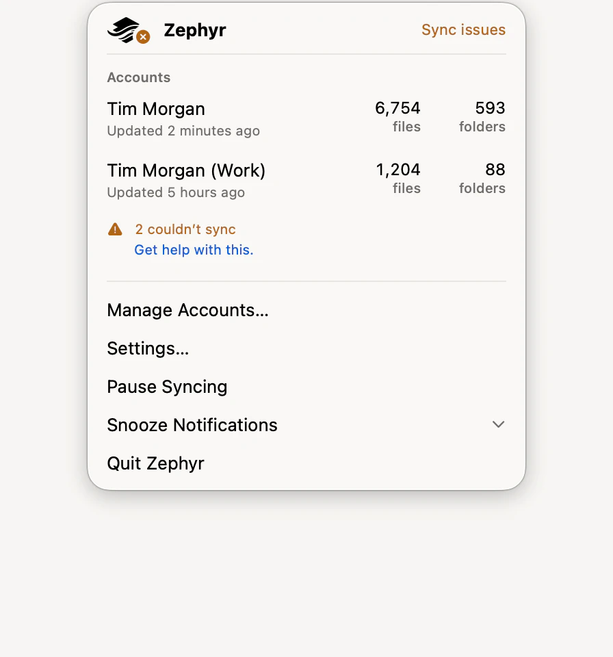

# Zephyr

[](https://github.com/RISCfuture/Zephyr/actions/workflows/test.yml)
[](https://github.com/RISCfuture/Zephyr/actions/workflows/lint.yml)
[](https://github.com/RISCfuture/Zephyr/actions/workflows/periphery.yml)
[](https://developer.apple.com/)
[](LICENSE)

Zephyr is an open-source Dropbox client for macOS, written in Swift. Your Dropbox
appears in the Finder sidebar and files download when you open them — there is no
folder full of everything you own sitting on the disk.

**Zephyr is not affiliated with, endorsed by, or sponsored by Dropbox, Inc.** It is an
independent client built against Dropbox's public HTTP API. Dropbox is a trademark of
Dropbox, Inc.

Zephyr 1.0 is published as a GitHub release. The App Store edition has not been
released. Treat it accordingly.

<p align="center">
  
</p>

## What It Is

Zephyr is a reimplementation of [Maestral](https://github.com/samschott/maestral) —
the open-source Python Dropbox client — as a native macOS app built on Apple's
**replicated File Provider** model.

That model is the substance of the difference. Maestral and the official Dropbox client
both keep a real folder on disk and reconcile it against the server. A replicated File
Provider doesn't: macOS owns the file tree, the extension answers the system's questions
about it, and content is materialized on demand. So:

- **Files live in the Finder sidebar, not in a watched folder.** Nothing is downloaded
  until something opens it. Evicting a file is a system operation, not a Zephyr feature.
- **There is no local scan, and no local watcher.** Every question Finder asks —
  enumerate this folder, what changed since this anchor, give me these bytes — is
  answered from a per-account SQLite index of remote state.
- **The engine is a mirror, not a merge.** Zephyr's job is keeping that index equal to
  the account's remote state and handing the system change batches; the system decides
  what to do about the files.

What Zephyr keeps from Maestral: its always-excluded filename set, its history-retention
window, its longpoll backoff padding, and the `com.dropbox.ignored` extended-attribute
convention it shares with the official client. What it doesn't keep: Maestral requires a
manual rebuild when Dropbox resets a delta cursor, and Zephyr rebuilds automatically.

## Features

### Your Dropbox in Finder

- **One sidebar location per account**, labelled `Zephyr (your@email.address)` and
  opening onto a folder named **Dropbox**. Nothing is mirrored: a terabyte account costs
  no local space until something is opened.
- **Files download when you open them.** Opening, Quick Look, an Open dialog, a copy,
  and a drag are ordinary filesystem operations macOS turns into a fetch.
- **Thumbnails without downloading.** Finder shows real image previews for jpg, png,
  tiff, gif, webp, ppm, and bmp files under 20 MB, rendered by Dropbox from bytes this
  Mac has never held.
- **A change made somewhere else turns up in seconds** — a 40-second longpoll on
  Dropbox's notify endpoint, then a delta page, then Finder re-enumerates.
- **Every transfer is verified.** A download is checked against Dropbox's content hash
  before it replaces anything and lands atomically; an upload carries a `content_hash`
  for the server to check. Files over 4 MiB upload in chunks, checkpointed as each is
  acknowledged, so an upload survives the process dying.
- **Nothing is overwritten blindly.** A new file uploads with autorename; an existing
  one updates against the revision the index knows. Two Macs editing at once produce a
  second file Dropbox names itself, not a lost edit.
- **Moves and renames happen on the server.** No bytes travel, and a folder move
  rewrites the whole indexed subtree in one transaction.
- **Personal Dropboxes and Business team spaces both work** — each account's calls carry
  its own path root.
- **Some names never travel**: `.DS_Store`, `desktop.ini`, `thumbs.db`, `Icon\r`,
  `.dropbox`, Office lock files and the rest, in both directions. Google Docs and other
  cloud documents never appear at all, since there are no bytes to download.
- **There is no Dropbox trash.** Dropbox has no trash API; recovery is version history.

### Versions, and keeping a file off Dropbox

- **Show Previous Versions…**, in Finder's context menu on one selected file, opens a
  sheet listing the revisions Dropbox kept, newest first, the current one marked, with
  **Restore…** beneath. Revisions are looked up by Dropbox item ID, so renaming a file
  doesn't end its history, and restoring adds a new newest version rather than
  rewinding.
- **Delete from Dropbox, Keep on This Mac** downloads the item and everything under it
  first and only then deletes Dropbox's copy — if any file can't be fetched, nothing is
  deleted. **Put Back on Dropbox and Resume Syncing** reverses it.
- **Excluded items carry the badge "Not on Dropbox — this Mac only"**, are listed under
  **Settings ▸ Not Syncing** with a **Resume** button each, and are marked with the same
  `com.dropbox.ignored` extended attribute the official Dropbox client reads and writes.

### The app around it

- **A menu-bar panel** with a row per account — name, status, file and folder counts —
  that reveals the account in Finder, plus **Pause Syncing**, **Snooze Notifications**,
  **Manage Accounts…** and **Settings…**.
- **First-run setup**, seven pages, covering linking an account, enabling Zephyr in
  System Settings, notification authorization, and the login item — and saying which of
  the three macOS is withholding.
- **Linking happens on Dropbox's own authorization page**, in a system web session: the
  password never reaches Zephyr. Link any number of accounts; each gets its own Finder
  location and its own index.
- **A Sync Issues window** listing what failed and why, per account, with a route to the
  file.
- **Notifications at four levels** — all file changes, sync issues, errors only, or none
  — digested rather than one per file, and snoozable for 30 minutes, an hour, or eight
  hours. A snooze defers rather than discards: everything it silences arrives when it
  ends.
- **Transfer limits**, up and down, from 250 kB/s to 100 MB/s or unlimited, applied to
  transfers already running. A separate, lower limit applies on a metered network, with
  a switch for whether to keep indexing there at all.
- **Seven days of sync history**, and **automatic recovery** when Dropbox resets the
  delta cursor: Zephyr re-lists on its own, and Finder tags, favorite ranks, extended
  attributes and exclusions all survive it.
- **A diagnostics report** on demand from **Settings ▸ Troubleshooting**, saved and
  revealed in Finder. It names your files, which is why nothing sends it for you.
- **Settings belong to the Mac**, not to an account. Two accounts syncing at once share
  one bandwidth budget and one notification level.

### Outside the app

- **A Sync Status widget**, small and medium, showing file counts and sync issues — the
  first account on the small size, up to three on the medium. It is only as fresh as the
  last time the app ran.
- **A Pause Syncing control for Control Center**, which reads and writes the File
  Provider domains itself, so it is right with Zephyr closed.
- **A share extension** — **Zephyr** in every macOS Share menu — taking up to 20 files
  at a time, with an account picker, a destination menu of recent folders and a browser,
  and Quick Look previews of what is staged. It never overwrites: uploads autorename.
- **Six Shortcuts actions** in both editions: pause or resume syncing, snooze
  notifications, get sync status, upload a file, get a share link, and restore a file to
  an earlier revision. Three of them are offered in Spotlight and to Siri with no setup.
- **A 22-command `zephyr` tool** in the downloadable edition — see [Command-Line
  Tool](#command-line-tool).

## Installing

Install one edition, not both — see [Editions](#editions).

**From GitHub.** Every release publishes exactly one artifact: a notarized installer
package. There is no disk image, and that is deliberate. A copy dragged out of a `.dmg`
carries a quarantine flag, macOS then runs it from a throwaway App Translocation mount,
and it refuses to run a File Provider extension for a translocated process at all — so a
dragged Zephyr can never put a Dropbox in Finder, however long it is left to try. The
package writes the app straight into `/Applications` and the flag is never applied. The
update checker offers whichever asset a release carries, so carrying only this one is
also what keeps it from ever handing you the other.

The package has one optional component, **Command-Line Tool**, which links the bundled
`zephyr-cli` into `/usr/local/bin` as `zephyr`. Clearing the checkbox installs the app
without it; Settings keeps offering the command afterwards.

**From the App Store.** The same app, without the command-line tool and without the
self-updater.

Either way, macOS holds every File Provider off until you switch it on yourself — see
[Running It](#running-it).

## Architecture

Everything from here on is about how Zephyr is built rather than what it does.

### Layout

`libZephyr` is the whole client. The app, the extensions, and the CLI are shells over it.

| | |
| --- | --- |
| `libZephyr/DropboxAPI` | The API client: typed routes over a `HTTPTransport`, PKCE token refresh, retry/backoff, per-account path-root headers, and bandwidth throttling on both directions. |
| `libZephyr/Index` | `SyncIndexStore` — a WAL-mode SQLite database (GRDB) per account holding every known remote item plus the delta cursor. The cursor commits in the same transaction as the page of mutations it reflects, so a crash can't leave the index claiming state it doesn't have. |
| `libZephyr/Engine` | `RemoteIndexer` runs the resumable initial recursive listing, applies delta pages, and watches the change feed. `DeltaInterpreter` turns one page of entries into index mutations and history events, and is pure. |
| `libZephyr/ProviderCore` | `ProviderAdapter` — the extension's engine-facing brain. Enumeration anchors handed to macOS are generations in the index's `anchors` table, each mapping back to the delta cursor the index reflected at that moment. |
| `libZephyr/Hashing` | An incremental implementation of Dropbox's content-hash algorithm, used to verify every transfer. |
| `libZephyr/Facade` | `AccountManager` and `AccountSession`: the public surface every shell talks to. |
| `libZephyr/Auth` | PKCE, the OAuth flow, and the two token stores — the app group's and the CLI's. |
| `libZephyr/Config` | The container layout, the account registry, and the machine-wide bandwidth and notification settings. |
| `libZephyr/Versions` | The revision list and restore behind **Show Previous Versions…**. |
| `libZephyr/Share` | The share extension's model: staging files, resolving a destination, uploading. |
| `libZephyr/Intents` | The Shortcuts actions the framework defines, and the entities they resolve. |
| `libZephyr/Design` | Shipping SwiftUI: the version-history sheet, the share-upload view, the widget's layouts, the menu-bar mark. |
| `libZephyr/Errors` | `ItemSyncFailure` and the rest of the failure vocabulary every surface reports in. |
| `libZephyr/Support` | Logging, crash reporting and its redaction pass, content hashing, and the help anchors. |

`Design`, `Share` and `Versions` are why `libZephyr` is not headless. The File Provider UI
and share extensions have to draw something, and they cannot link `Zephyr Common` — so the
views they draw live in the framework they and the app both already link.

Shared state lives in the app group container (`group.codes.tim.Zephyr`), under
`Library/Application Support/Zephyr`, which the app, the extensions, and the CLI all read:

```text
Zephyr/
├── accounts.json                  the account registry
├── bandwidth.json                 the Mac's transfer limits
├── notifications.json             the notification level and snooze deadline
├── widget-status.json             the snapshot the widget renders
├── install-id                     the random identifier crash reports carry
└── Accounts/<account_id>/
    ├── config.json                the account's own facts: email, path root, link date
    ├── index.sqlite               the sync index
    └── cache/                     temporary download staging
```

The two machine-wide settings are files rather than `UserDefaults`, because
`UserDefaults(suiteName:)` does not resolve an app-group suite the same way for a
sandboxed app and a tool that isn't one — the app's lands in the group container, the
CLI's in `~/Library/Preferences`. Two files, and a setting written by either would be
invisible to the other.

Refresh tokens do *not* live there — see [Two keychains](#two-keychains).

### Targets

- **libZephyr** — the framework above. Everything else is a shell over it.
- **Zephyr Common** — the framework holding the menu-bar app itself: the model, every
  window and view, Settings, and first-run setup. Both editions link it, and it is where
  nearly all app-layer code lives.
- **Zephyr (MAS)** and **Zephyr (download)** — the two editions. Each is a target
  containing little more than its own entry point (`Zephyr-MAS/ZephyrMASApp.swift`,
  `Zephyr-download/ZephyrDownloadApp.swift`), entitlements, and icon; what differs
  between them is described under [Editions](#editions).
- **FileProvider** — the replicated File Provider extension, one domain per linked
  account. It also vends the headless Finder context-menu actions **Delete from Dropbox,
  Keep on This Mac** and **Put Back on Dropbox and Resume Syncing**.
- **FileProviderUI** — the sheet behind the Finder context-menu action **Show Previous
  Versions…**, which lists the revisions Dropbox kept of a file and puts one back. It
  reaches the account layer itself, so it works whether or not the app is running.
- **ShareExtension** — upload to Dropbox from any app's share sheet.
- **WidgetExtension** — a desktop widget showing each account's file counts and sync
  issues, fed by a snapshot the app publishes to the shared container. It also vends the
  **Pause Syncing** control for Control Center, which reads and writes the File Provider
  domains itself rather than through the app, so it works with Zephyr closed.
- **zephyr-cli** — the command-line tool, embedded as `Contents/Helpers/zephyr-cli` in
  the downloadable edition and reaching the `PATH` as `zephyr` through a symlink. The
  App Store edition omits it.
- **libZephyrTests**, **ZephyrTests**, **ZephyrUITests** — the test targets.

### Schemes

Ten shared schemes. Five of them are the ones you reach for:

| Scheme | Builds | Tests |
| --- | --- | --- |
| `Zephyr (MAS)` | the App Store edition and the extensions | `ZephyrTests`, `ZephyrUITests` |
| `Zephyr (download)` | the downloadable edition, the extensions, and the CLI | — |
| `libZephyr` | the framework | `libZephyrTests` |
| `zephyr-cli` | the command-line tool | — |
| `Zephyr UITests` | the app | `ZephyrUITests` alone |

`Zephyr UITests` exists because the screenshot lane needs a test action carrying the UI
tests and nothing else: `Zephyr (MAS)` carries `ZephyrTests` too, and that bundle names
its host by `TEST_HOST` path — which either edition's `Zephyr.app` satisfies — so
running it pulls the downloadable edition into the same derived data and the two collide
over every product they share. The rest are the per-target schemes.

Both editions build a product named `Zephyr.app`, so building one replaces the other
in a shared derived-data directory. The test bundles are hosted by `Zephyr (MAS)`.

### Editions

Zephyr ships two editions from one project. They share a bundle identifier
(`codes.tim.Zephyr`), all four extensions, the app group, the keychain group, and every
line of their interface. Only one can be installed at a time.

| | App Store | Download |
| --- | --- | --- |
| Signing | App Store distribution | Developer ID, notarized |
| Updates | the store keeps it current | checks GitHub Releases itself |
| `zephyr` command-line tool | not shipped | embedded; the installer package links it into `/usr/local/bin` |
| Shortcuts actions | yes | yes |

The App Store forbids an app both updating itself and installing a tool onto the user's
`PATH`, so the App Store edition ships without either. Nothing is conditionally
compiled:
the difference is entirely in what each target's entry point injects — a
`FeatureFlags` value and, for the downloadable edition only, an `UpdateChecking`. Shared
views read those and, where a control cannot be offered, say so and link to the
downloadable edition.

#### Install only one

Sharing a bundle identifier means sharing a File Provider registration. macOS keeps one
provider record per extension bundle identifier — a single `Provider.plist` holding one
owning-app URL — so it cannot tell the two editions apart, and PlugInKit elects whose
extension serves files by version rather than by which app is running. With both
installed, an older edition's extension can end up driving an index a newer one migrated.

`SyncIndexStore` refuses that rather than writing through it: an index carrying
migrations this build doesn't know is rejected with
`IndexStoreFailure.schemaFromNewerBuild` instead of being silently half-read.

To switch editions, install the new copy and launch it, confirm the account still
appears in Finder, and only then delete the old one. Deleting first can reap the domain
and its `~/Library/CloudStorage` mount.

## Requirements

Zephyr is written in Swift 6 and requires macOS 26.

Building it needs Xcode with a Swift 6.3 toolchain — what CI pins — and an Apple
Developer team. The team is not optional if you want to see the thing work:
`NSFileProviderManager.add(domain:)` accepts only a bundle signed with a real team
identifier, so an unsigned build registers no domain and puts nothing in Finder.

The fastlane lanes below want Ruby 4.0.6 (`.ruby-version`, gemset `zephyr` from
`.ruby-gemset`) and the gems `Gemfile` pins — `fastlane ~> 2.237`, plus the three
default gems Ruby 4 no longer bundles. Run `bundle install` once, then `bundle exec
fastlane …`.

## Building

Open `Zephyr.xcodeproj` and build the scheme for the edition you want. Either one builds
the app and the four extensions; `Zephyr (download)` builds the command-line tool as
well.

```sh
xcodebuild build -project Zephyr.xcodeproj -scheme "Zephyr (download)"
```

### The Dropbox app registration

A fresh clone builds and links an account with no additional setup. Zephyr's Dropbox app
key is committed in `Config/Zephyr.xcconfig`.

That is deliberate, not an accident. The app key is an OAuth **public client
identifier**, not a secret: Zephyr authenticates with PKCE and never sends a client
secret, and the key is already visible in every authorization redirect the app performs.
There is no app-secret setting anywhere in the project.

To build against your own registration instead:

1. Register an app at <https://www.dropbox.com/developers/apps>, choosing **Scoped
   access** and **Full Dropbox**.
2. Enable exactly the scopes listed in `libZephyr/Auth/DropboxAppCredentials.swift`:
   `account_info.read`, `files.metadata.read`, `files.content.read`,
   `files.content.write`, `sharing.read`, and `sharing.write`. A missing scope surfaces
   as an authorization failure at the first call that needs it, not at link time.
3. Copy `Config/Secrets.example.xcconfig` to `Config/Secrets.xcconfig` and fill in your
   key.

`Config/Secrets.xcconfig` is gitignored, and `Zephyr.xcconfig` pulls it in with an
optional `#include?` placed *after* the default assignment — so whatever it sets wins,
and its absence costs nothing. Either way the key is injected into libZephyr's
`Info.plist` at build time and read back from there at runtime.

### Signing

Both app targets claim the app group `group.codes.tim.Zephyr` and a keychain access
group written as `$(AppIdentifierPrefix)codes.tim.Zephyr` —
`Zephyr-MAS/Zephyr.entitlements` and `Zephyr-download/Zephyr-download.entitlements`,
with matching files for each extension. `GroupKeychainTokenStore` in
`libZephyr/Auth/TokenStore.swift` reads the same prefix back out of the framework's
`Info.plist`, where `ZEPHYR_KEYCHAIN_TEAM_PREFIX = $(AppIdentifierPrefix)` in
`Config/Zephyr.xcconfig` puts it.

So building under a different team needs no source edit: set the team, and the
entitlement and the lookup move together. The team prefix written literally in
`TokenStore.swift` is only the fallback for a build with no profile at all — one that
carries no `keychain-access-groups` entitlement and so cannot reach the group under any
name.

## Running It

A File Provider extension is not something you can just build and run. Two things have
to be true before your Dropbox shows up in Finder.

**The copy you launch must not be quarantined.** macOS runs a quarantined app out of a
throwaway App Translocation mount, and refuses to run a File Provider extension for a
translocated process at all — so a build dragged out of a downloaded disk image can
never put a Dropbox in Finder. The folder is not the test
(`InstallLocation.isTranslocated` looks for `AppTranslocation` in the bundle's path),
but `/Applications` is where the installer puts it, and Finder reads a domain's
context-menu actions from whichever bundle serves that domain — so a copy left in a
build directory vends no Finder actions. Copy `Zephyr.app` to `/Applications` and launch
it from there.

**You have to switch the provider on yourself.** Registering a domain is not enough;
macOS asks the user, not the app. Go to **System Settings ▸ General ▸ Login Items &
Extensions ▸ File Providers** and enable Zephyr. First-run setup walks through this,
along with notification authorization and the login item, and detects when any of the
three has been withheld — but it can only open the pane. It cannot grant anything.

Note that Zephyr only appears in that list once an account is linked, since there is no
domain to enable before then.

Keeping Zephyr running matters: the app hosts the change watcher, so Finder learns about
remote changes within seconds only while it's alive. That's what the login item is for.

### When a domain wedges

File Provider domains outlive the app, and a domain registered by an older build keeps
its old settings. When one gets into a state you can't talk it out of:

```sh
/Applications/Zephyr.app/Contents/MacOS/Zephyr --reset-domains
```

That deregisters every File Provider domain and quits — see
`resetDomainsAndQuitIfRequested` in `Zephyr Common/App/ZephyrScenes.swift`. The next
normal launch re-registers them from the account registry, and each domain re-indexes
from scratch.

## Command-Line Tool

The downloadable edition bundles the tool at `Contents/Helpers/zephyr-cli`. It reaches
your `PATH` as `zephyr` one of two ways: the installer package's optional **Command-Line
Tool** component lays the symlink down as root, or you run the `sudo ln -sf` command
**Settings ▸ Command-Line Tool** hands you to copy. The app cannot do it itself —
writing into `/usr/local/bin` goes through an authorization right the App Sandbox grants
only to a build Apple has entitled for privileged file operations, and withholds without
ever prompting, so Settings offers the command rather than a button that would fail
silently.

The App Store edition does not ship the tool: installing anything onto the user's `PATH`
puts code outside the app bundle, which the store forbids. Its Settings pane says so and
links to the downloadable edition.

### Two keychains

The app and its extensions keep refresh tokens in a data-protection keychain item shared
across the app group. The CLI is not sandboxed and keeps its own in your login keychain.
Both read the same account registry and the same sync index, so the CLI will *list* an
account the app linked — but it can't authenticate as one it didn't link itself. Run
`zephyr auth link` once for the CLI, even if the app is already set up.

Commands operate on the sole account *the CLI can authenticate as*, unless you pass
`--account`. An account the app linked but `zephyr auth link` never did is not one of
them: naming it exits 69, the same as naming nothing at all.

Four commands take no `--account`, because what they read and write belongs to the Mac
rather than to an account: `bandwidth-limit`, `notify`, `log`, and `gui`. Every linked
account shares what the first two set.

| Command | |
| --- | --- |
| `zephyr auth link` | Link a Dropbox account via OAuth. |
| `zephyr auth list` | List linked accounts, whether the CLI can authenticate as each, and any stored token that belongs to no linked account. |
| `zephyr auth status` | Show the linked account and its usage. |
| `zephyr auth unlink` | Unlink an account, revoking Zephyr's access. |
| `zephyr ls` | List a Dropbox folder. |
| `zephyr get` | Download a file, verifying its content hash. |
| `zephyr put` | Upload a file. |
| `zephyr rm` | Delete a file or folder. |
| `zephyr mkdir` | Create a folder. |
| `zephyr mv` | Move or rename, server-side. |
| `zephyr revs` | List a file's stored revisions. |
| `zephyr restore` | Restore a file to an earlier revision. |
| `zephyr diff` | Compare two revisions of a file. |
| `zephyr sharelink create\|list\|revoke` | Manage shared links. |
| `zephyr bandwidth-limit up\|down\|metered` | Show or set this Mac's transfer bandwidth limits, in MB/s; `0` is unlimited. |
| `zephyr status` | Show the account's sync-index state. |
| `zephyr filestatus` | Say whether one item is synced, failing, excluded, or unknown. |
| `zephyr find` | Find items by name, kind, size, or age, from the index alone. |
| `zephyr ignored` | Inspect the items excluded from syncing. |
| `zephyr history` | Show recently synced changes. |
| `zephyr rebuild-index` | Drop and rebuild the sync index from the current remote state. |
| `zephyr watch` | Mirror the change feed into the sync index, printing changes live. A diagnostic: it advances the delta cursor the extension owns, so it is not a way to keep an account in sync. |
| `zephyr notify level\|snooze` | Show or change Zephyr's notification settings. |
| `zephyr log show` | Read Zephyr's messages from the unified log. |
| `zephyr gui` | Open the Zephyr app. |

Twelve of them take `--json` for machine-readable output: `auth list`, `auth status`,
`ls`, `revs`, `sharelink create`, `sharelink list`, `status`, `filestatus`, `find`,
`ignored list`, `history`, and `log show`.

`zephyr` exits 69 (`EX_UNAVAILABLE`) when no account is linked, so scripts can tell that
apart from a real failure.

### Shell completion

`zephyr --generate-completion-script <shell>` writes a completion script for `zsh`,
`bash`, or `fish`. Put it where your shell looks for one.

**zsh** — the script has to be named `_zephyr` and live on your `fpath`:

```sh
mkdir -p ~/.zsh/completions
zephyr --generate-completion-script zsh > ~/.zsh/completions/_zephyr
```

then add this to `~/.zshrc` *above* the `compinit` call, and start a new shell:

```sh
fpath=(~/.zsh/completions $fpath)
```

`/usr/local/share/zsh/site-functions` is already on the default `fpath`, if you'd rather
install it for every user than edit `~/.zshrc`.

**bash** — save it anywhere and source it from `~/.bash_profile`:

```sh
zephyr --generate-completion-script bash > ~/.zephyr-completion.bash
echo 'source ~/.zephyr-completion.bash' >> ~/.bash_profile
```

**fish** — fish reads completions out of a fixed directory:

```sh
zephyr --generate-completion-script fish > ~/.config/fish/completions/zephyr.fish
```

Subcommands and options complete from the tool's own definitions. Two things complete
from Zephyr's state instead:

- **Accounts.** `--account` takes an opaque `dbid:` string nobody types from memory, so
  it completes from the accounts the CLI can authenticate as. Offering one it would
  refuse helps nobody.
- **Dropbox paths.** `get`, `put`, `rm`, `mv`, `revs`, `restore`, `diff`, `filestatus`,
  and `sharelink` complete their path arguments out of the sync index, one folder per
  Tab; `ls` and `mkdir` complete folders only; `find` and `history` complete their
  `--under` option the same way. The index describes the whole account rather than the
  bytes on this disk, so a folder nothing has ever downloaded completes exactly like one
  that's fully materialized — which a client that completes by scanning a local folder
  can't do.

Path completion reads the index read-only and never touches the network. When there's no
index yet, no linked account, or several linked accounts and no `--account` saying which,
it offers nothing rather than an error: a completion handler that fails is a shell you
can't type in.

## Shortcuts

Both editions add the same six actions to the Shortcuts app, so the App Store edition
has a way to be scripted even though it can't ship the command-line tool. They run with
the app closed — it starts in the background, does the work, and doesn't come to the
front.

| Action | |
| --- | --- |
| Pause or Resume Syncing | Stop or start syncing for every account. |
| Snooze Zephyr Notifications | Hold every notification for a while, or end a snooze. |
| Get Sync Status | Indexed file and folder counts, and how many items couldn't sync. |
| Upload to Dropbox | Send a file to a folder. |
| Get Dropbox Share Link | A link to an item, made or already in place. |
| Restore Dropbox File | Put a file back to a stored revision, after confirming. |

Three of the six are also App Shortcuts, offered in Spotlight and to Siri with no setup:
Pause or Resume Syncing, Snooze Zephyr Notifications, and Get Sync Status. The other
three need a file or a folder chosen first, which belongs in a shortcut somebody built
rather than on a list of things to say out loud.

Pausing is also a Control Center control, added from **Edit Controls** at the bottom of
Control Center. It is the same verb the menu bar item offers, in a place that doesn't
require finding the menu bar item first, and the two always agree.

The file and folder parameters resolve out of the sync index rather than the disk, so an
item nothing has ever downloaded is offered exactly like a materialized one — the same
property the shell completion has, for the same reason.

Actions act as the accounts the **app** linked, not the ones `zephyr auth link` did —
see [Two keychains](#two-keychains). Commands operate on the sole linked account unless
the shortcut names one; with several linked and none named, the action asks.

The intents live in `libZephyr/Intents` and `Zephyr Common/Intents`, and each edition
declares an `AppIntentsPackage` naming the framework's, which is what carries a
framework-defined intent into the app's own `Metadata.appintents`. The widget extension
declares one of its own for the same reason: Control Center runs the Pause Syncing
control's intent out of the extension's bundle, and without the package it would build,
install, appear in the gallery, and do nothing.

What sits where follows what a target can reach. `Zephyr Common/Intents` holds the two
that need app-layer state — snoozing goes through `NotificationManager`, and pausing is
grouped with it. The domain work underneath pausing is not app-layer: `DomainConnection`
in `libZephyr` disconnects and reconnects the domains, which `NSFileProviderManager`
permits from any executable inside the app bundle whose identifier is prefixed by the
app's and which shares the provider's document group. That is what lets the widget
extension pause syncing itself.

## Help

Both editions ship an Apple Help book, `Help/Zephyr.help`, reached from **Help ▸ Zephyr
Help** and from the help buttons on each Settings section, on the Sync Issues window,
and beside anything that has gone wrong. It is written to the shape of Apple's own user
guides: one task per page, titled as the reader's goal or the reader's symptom.

A build phase on each app target stages the book into the app and builds its search
index, and **fails the build** when `libZephyr/Support/HelpAnchor.swift` names an anchor
the book doesn't define — a misspelled anchor doesn't error at runtime, it silently
opens the book's first page.

`helpd` serves a copy it took the first time it saw the book, keyed on the app's
marketing version, so an edit will not appear until you run
`Scripts/purge-help-cache.sh` and then open the book at its root. `Help/README.md` is
the whole story, and worth reading before editing a page.

## Screenshots

Every picture on the marketing site and in the help book is a build product rather than
something someone remembered to retake. `bundle exec fastlane screenshots` runs one UI
test class against canned accounts — no keychain, no domain, no network — with the
process pinned to one appearance and a flat fill behind every window, and writes both
appearances of every capture into `docs/assets/screenshots` and the help book's `images`
directory. It refuses to run on CI: a hosted runner draws to a display that isn't 2×, and
a soft half-size set looks wrong only once it has been published.

The App Store set is captured by the same lane, but only staged by it: four of the slugs,
light alone, each composited onto an opaque canvas in `fastlane/screenshots` and numbered
in the order the listing shows them, because App Store Connect rejects the alpha channel
a rounded window corner leaves behind and orders a set by file name. Pushing it is a
separate lane, `bundle exec fastlane mac upload_app_store_screenshots`, and
`fastlane/screenshots` is gitignored — so nothing in the repository says what the
listing currently shows.

Settings is photographed twice out of the one window, in the one launch, with nothing
scrolled or clicked between the two. `settings` is the whole of it, which is what the
site and the App Store listing show, where the point is the breadth of what Zephyr lets
you decide. `settings-bandwidth` is the band between the Bandwidth and Metered Networks
help buttons, and is what the help book's page on limiting bandwidth embeds: a page about
two sliders wants the sliders legible, and the whole window scaled into the column a help
window gives it is a picture of a window rather than of the setting the paragraph beside
it describes. The close framing settles an edition problem as well. Settings is the one
window where the two editions differ — Updates says the App Store keeps Zephyr up to
date, and the Command-Line Tool section is worded for the store — and the capture is of
the App Store edition, because that is the app the UI test target hosts, while the one
help book is built into both. Framed on the Bandwidth section alone, neither line is in
the picture, and one image can stand on a page a reader of either edition opens.

Some of what it photographs the app itself never puts on screen. The version-history
sheet belongs to a File Provider UI extension, the share sheet to a share extension, and
the widget's layouts to WidgetKit — none of whose hosts a UI test can launch, stage, or
pin to an appearance. The app hosts each surface in a window of its own instead
(`Zephyr Common/UITestSupport/DesignGallery.swift`) and the suite photographs that. Every
pixel is still Zephyr's: both extensions set their view as the whole of their sheet.

The lane does not stop at having written the files. `verify_screenshots` fails the run
unless every required capture is there, unless each light capture and its dark twin are
the same size, unless some page in `docs/` or in the help book embeds it, and unless the
width and height a page declares are the size the file actually is — full pixels on the
site, halved on a help page, which is what draws a 2× capture at the size of the window
it was taken of. Every one of those is silent when it goes wrong: a set can be complete,
current, and wrong in any of them without a page looking broken to whoever last opened
it, in the appearance they happen to run in. The size check is what the menu-bar panel's
stated frame answers to. A `MenuBarExtra`'s window reaches no accessibility tree, so that
capture is picked out of an area of the screen rather than framed on a window, and the
shadow it is found by reads further on a light backdrop than on a dark one — so it is
published in a frame of a stated size, 448×480 pt, and the pair comes out identical by
construction. A page writes one width and one height for both appearances and swaps only
the file underneath, so a pair that disagreed would be drawn stretched in the dark and
nowhere else.

What macOS draws *around* Zephyr is a different matter, and can only be photographed for
real — Finder's context menu, that sheet on the Finder window it was opened from, the
widget in Notification Center, the control in Control Center, the File Providers switch
in System Settings. Each needs a linked account, a registered domain, and the app in
`/Applications`, because Finder reads a domain's actions from the bundle serving that
domain. `Scripts/capture-system-shots.sh` drives those, and writes into
`docs/assets/system` and a `system` directory beside the help book's images — kept apart
from the lane because the export script empties all three of its own directories on every
run. Nothing about those captures is reproducible, so nothing about them belongs in the
lane.

Each subject is framed on itself rather than on the screen. The context menu is found
through the accessibility API and cropped to its own bounds, the File Providers sheet to
the sheet rather than the window beneath it, Control Center to the grid of round tiles —
so a terminal behind the Finder window, the operator's name and Apple Account in the
System Settings sidebar, and the name of the Wi-Fi network are outside every frame rather
than things to notice afterwards. System Events cannot see a context menu at all, which is
why that one is measured by a program of its own.

What framing cannot reach is what a translucent surface refracts. Liquid Glass samples
whatever is behind it, so a Control Center panel over a blue wallpaper is a blue panel, and
one straddling the edge of a window behind it has a seam down the middle where the two
grounds meet. `Scripts/capture-backdrop.swift` lays a plain grey gradient across every
screen for the length of a run: above the desktop for the subjects photographed over a
window, which have to stay on top of it, and above every window for Control Center, whose
panel is drawn at status level and reaches across whatever is there regardless. Each
capture then refracts the same chosen ground rather than whatever the machine was showing.

Finder's context menu brings company of its own — it holds every installed app's
contributions, so Zephyr's two actions sit among whatever else the Mac has put there.
Those are populated lazily and are not in the accessibility tree when the crop is measured,
so they cannot be counted; but they always fall after the separator closing Zephyr's group.
`Scripts/finder-menu-frame.swift` finds the action `FileProviderUI/Info.plist` declares,
takes every row following it until the group ends, and cuts there. The menu in the picture
ends on **Delete from Dropbox, Keep on This Mac**.

`finder-menu` is the one subject needing something staged: a presentable folder in a Zephyr
domain, named with `--file`. Nothing in the repository can supply one, because the files
would be in somebody's Dropbox, and the folder is worth deleting again afterwards.

Two subjects are deliberately not captured. `finder-versions` would want a click of yours
on **Show Previous Versions…**, and nothing can do that for you: the call that opens a
Finder context menu blocks the only process that could then click an item in it, and
counting keystrokes down to the item would work on one Mac and hit **Move to Trash** on
another. `desktop-widget` wants the widget already sitting on the desktop. Neither is worth
the trouble, because the surfaces themselves are already in `images`, photographed by the
lane out of the design gallery — `file-versions`, and `widget-small` and `widget-medium`. A
second picture of either, taken by hand and going stale on its own, would be the same
surface at more cost.

`control-center-pause` is still the one to watch, for the opposite reason to a subject that
fails: with the control never added to Control Center it **succeeds**, and publishes a
photograph of a Control Center with no Zephyr in it. The script adds it for nobody.

Which leaves the script's closing line a rule rather than an aside: look at every image
before committing it, because whatever was on screen is in it. A capture that fails is
thrown away by whoever ran it. A capture that comes out plausible and wrong is the one that
gets committed.

**Three subjects are in the tree**, in both appearances: `finder-menu`,
`control-center-pause`, and `system-settings-file-providers`. Nothing embeds them yet, so
they cost a page nothing until one points at them.

## Testing

`libZephyrTests` is the real suite — the API client, content hashing, PKCE, error
mapping, retry policy, the index store, the provider adapter, and model decoding. Run it
from the `libZephyr` scheme. It needs no Dropbox account and no network.

`LinkedEndToEndTests` is the exception: it runs against the live Dropbox API and is
skipped unless a refresh token is in the environment.

```sh
TEST_RUNNER_DROPBOX_REFRESH_TOKEN=… xcodebuild test -scheme libZephyr
```

The prefix is the whole trick. `xcodebuild` does not forward its own environment to the
test runner; it forwards `TEST_RUNNER_`-prefixed variables with the prefix stripped.
Setting `DROPBOX_REFRESH_TOKEN` directly leaves the suite silently skipped and the run
green.

Everything it does happens under a uniquely-named remote folder that is deleted when the
test finishes, pass or fail. It exercises the paths a unit test can't fake: the 4 MiB
upload-session threshold, revision listing and restore, shared links, and the delta feed.

`ZephyrTests` is the app layer's own unit bundle — account failures, the notification
manager — and needs the app to host it, so it runs from the `Zephyr (MAS)` scheme rather
than from `libZephyr`.

`ZephyrUITests` covers the app's flows and is built on
[XCUITestKit](https://github.com/RISCfuture/XCUITestKit).

CI runs four jobs. `unit` runs `libZephyrTests` against the host-less `libZephyr`
scheme. `build` builds both editions' schemes, and is the only job that ever compiles
the four extensions and the command-line tool. `ui` runs `ZephyrUITests` and
`ZephyrTests` from the `Zephyr (MAS)` scheme. `docbuild` builds the DocC documentation
for `libZephyr`, the app, and the tool.

### What CI can't prove

`NSFileProviderManager.add(domain:)` accepts only a bundle signed with the real team
identifier, carrying the app group its extension shares with the app, installed where
`fileproviderd` will load it from, and switched on by a human in System Settings. A
hosted runner satisfies none of those, so no CI job attempts to register a domain — a
job that tried would be testing the runner's refusal, not Zephyr. Everything on either
side of that boundary is covered; the domain handshake itself is only ever verified by
running the app on a real Mac.

## Releasing

Pushing a version tag builds both editions. The App Store build is uploaded to App Store
Connect, where attaching it to a version and submitting it for review is still manual.
The downloadable build is notarized, packaged as an installer package, and published as
a GitHub release. That package is the release's only asset, for the reason given under
[Installing](#installing). Tags carry no `v` prefix — the downloadable edition's update
checker compares release tags against `CFBundleShortVersionString`, so `1.2` is the tag
for version 1.2. The release workflow doesn't re-run the tests; tag a commit CI has
already passed.

Locally, `bundle exec fastlane mac release` ships the App Store edition and
`bundle exec fastlane mac download_release` the downloadable one; `beta` uploads the App
Store edition to TestFlight.

Signing credentials come from the private `RISCfuture/certificates` repository via
[fastlane match](https://docs.fastlane.tools/actions/match/). On CI they arrive as the
repository secrets `CERTIFICATES_TOKEN`, `MATCH_PASSWORD`, and `SENTRY_AUTH_TOKEN`.
Locally, copy `fastlane/.env.example` to `fastlane/.env` and fill it in.

### Crash reporting

[Sentry](https://sentry.io) is wired into all six Zephyr processes — the app, the File
Provider extension, its UI extension, the Share extension, the widget, and `zephyr` —
each tagged with a `component` so a crash can be told apart from the five others that
share the same framework and version. Only release builds report; every Debug build, and so every
preview, unit test, and UI test run, sends nothing.

Reports carry no path, file name, address, or token: `ReportRedaction` puts every string
through a pass that strips them, and `sendDefaultPii` is off so the SDK attaches no IP
address or device name. The one thing tying reports together is a random identifier
generated on the Mac and kept in the app group container.

Both app targets upload their dSYMs from a build phase when `sentry-cli` is installed,
and the release lanes upload the archive's dSYMs regardless, which is what makes
symbolication a property of the release.

## Privacy

Zephyr moves your files to and from Dropbox, so what it sends and what it keeps is worth
reading: the [privacy policy](https://riscfuture.github.io/Zephyr/privacy.html) covers the
OAuth scopes it requests, where the refresh token is stored, what the local sync index
holds, the update check, and the crash reports described above. There is no advertising
identifier and no cross-app tracking.

## License

Zephyr is licensed under the [MIT License](LICENSE).

The Swift packages it depends on carry their own terms; see [CREDITS.md](CREDITS.md) for
the full set, including the notices the Apache-2.0-licensed ones require.
